# online store

stack

Back

- node
- express
- postgresql
- sequelize

диаграмма баз данных(8таблиц)
авторизация JWT
Rest API

Front

- react
- react bootstrap
- axios (зпросы к серверу)
- react-router-dom (навигация)
- mobx (стейт менеджер)

endpoint methods
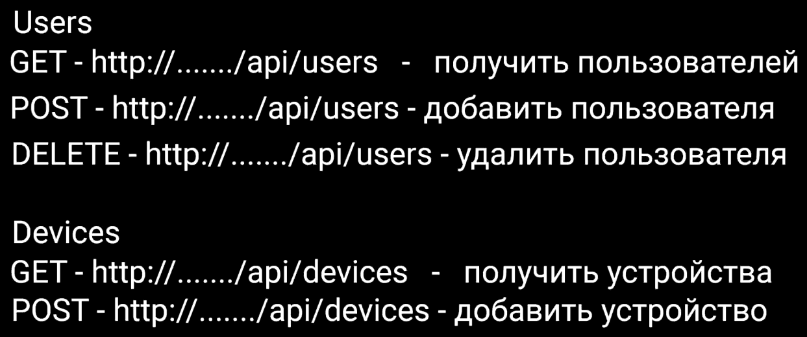
server endpoint func
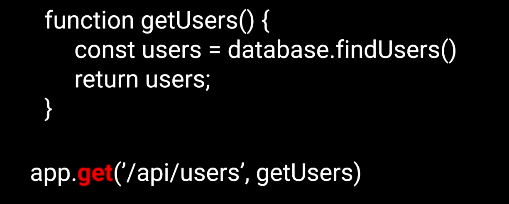
client query

[code](https://github.com/utimur/online-store-full-course)
[video](https://www.youtube.com/watch?v=H2GCkRF9eko)

alt + shift + a // multiline comments

init

    npm init -y
    npm i express pg pg-hstore sequelize cors dotenv
    npm i -D nodemon

install postgresql/create db

add diagrams

---

[draw.io](https://app.diagrams.net/)

---

### add tables

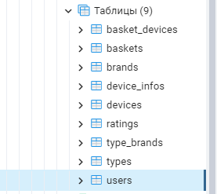

### test request

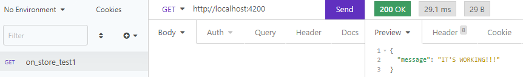

### check router

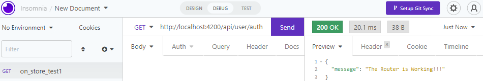

### check controllers

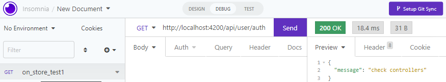

### check middleware

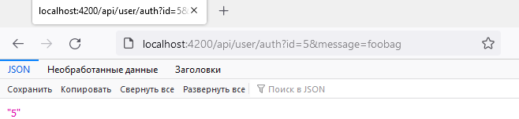

add obj to DB

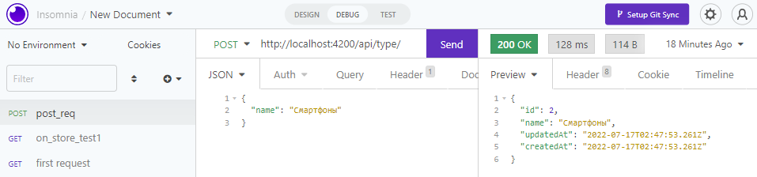
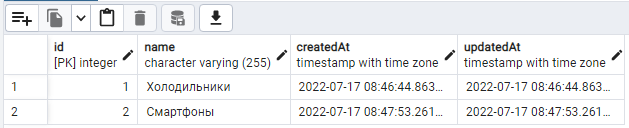

---

[this commit](https://github.com/viktishchenko/big-pets/commit/f4391c06bc0317ef118b674d00ff11ac470008dd)

get from to DB

---

[this file](./back/controllers/typeController.js)

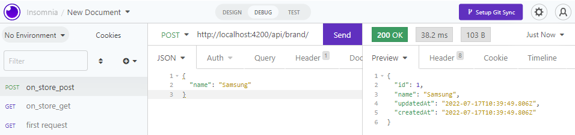
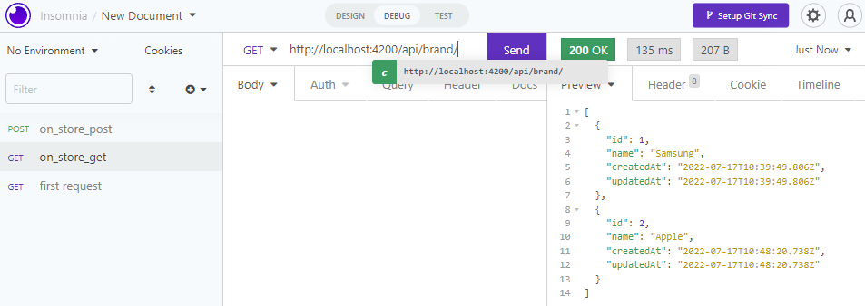

---

    npm i express-fileupload
    npm i uuid

---

### add/get static file to DB

[filter items by brandId & typeId →](./back/controllers/deviceController.js)

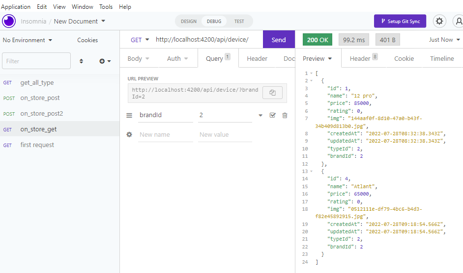

[page limit with DB →](./back/controllers/deviceController.js)

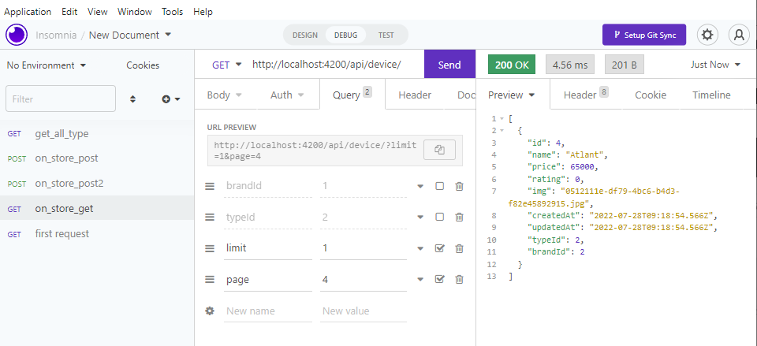

[page limit with DB und count →](./back/controllers/deviceController.js)

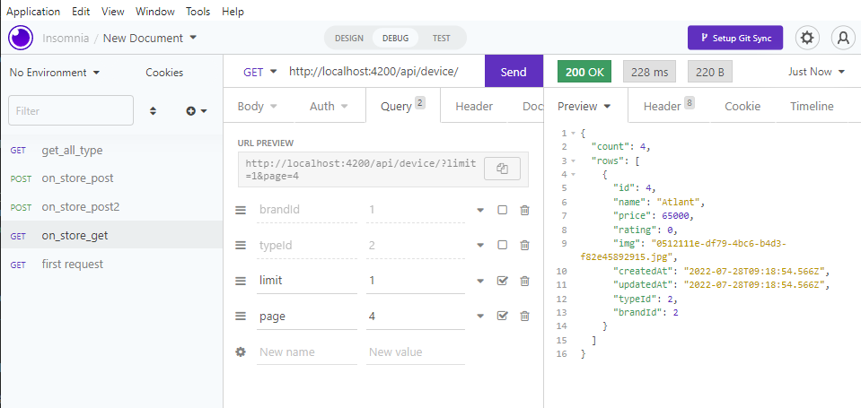

[add device info →](./back/controllers/deviceController.js)

Auth

    npm i jsonwebtoken bcrypt

[get token →](./back/controllers/userController.js)
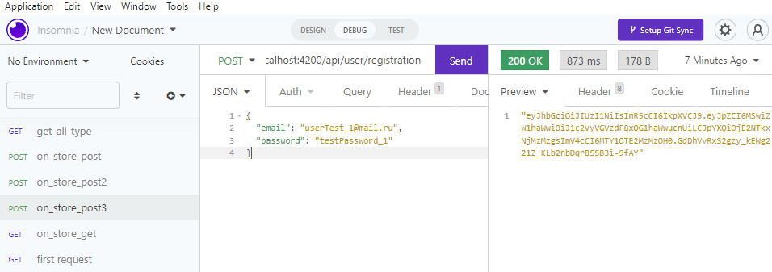

### check userName & password

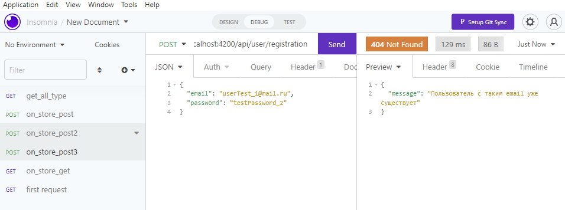

### check login

false

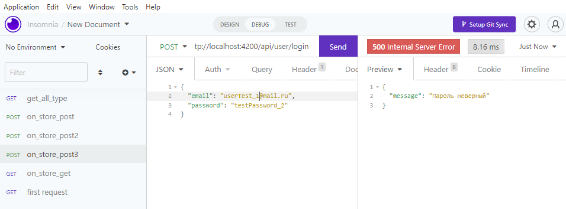

true

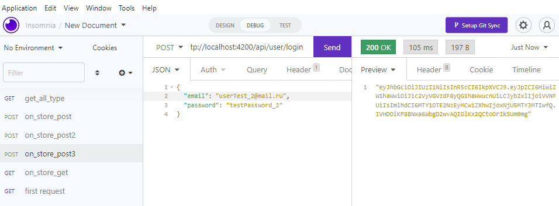

### check user auth

false

true

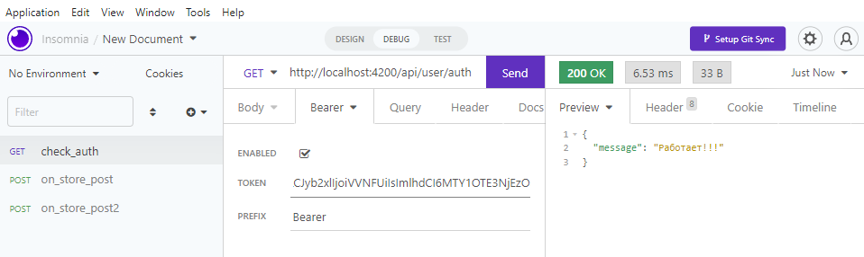

### check ADMIN

false

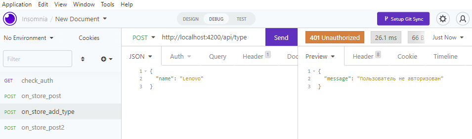

false

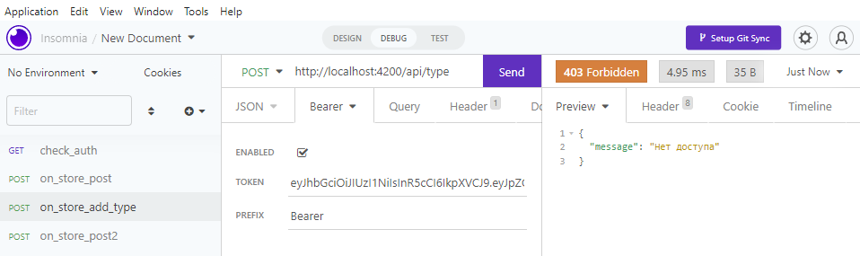

add ADMIN

hooray ADMIN

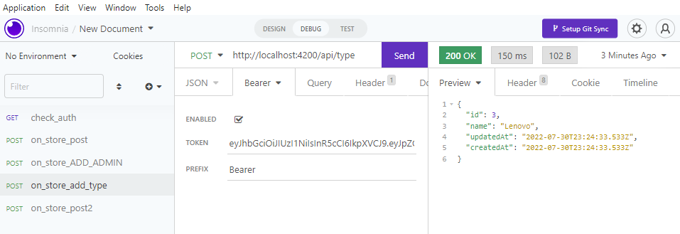

front

    npx create-react-app .
    npm i react-router-dom mobx mobx-react-lite
    npm install react-bootstrap bootstrap

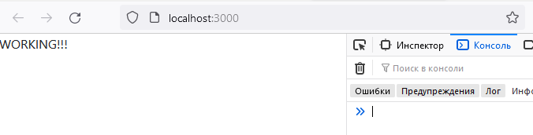

add routes, other stuff

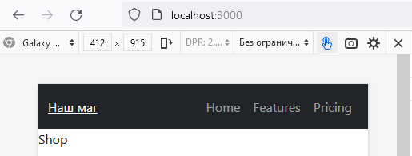

