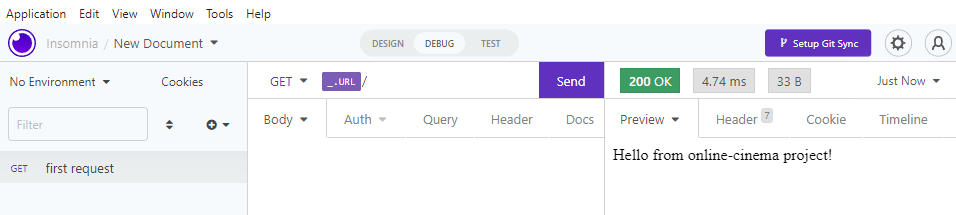

# online-cinema project with back & front parts

<details>
<summary>
start project
</summary>

```javascript

npm i --location=global nestjs/cli // install cli

mkdir online-cinema // create dir
cd online-cinema // switch to folder
type nul > README.md // create file README.md
nest new back  // create back dir with nest
npm // choose package maneger
delete .git folder

```

add import cost - vscode plagun (package size)

</details>

<details>
<summary>
initial settings
</summary>

1. set insomnia (get \_URL/) // first request
2. change port (main.ts) // 4200
3. add global [prefix](./back/src/main.ts) 'api'
4. set .prettierrc (semi, quote, ect.)
5. restart eslint server
6. check app / npm run start or npm run dev (with watch mode)
   

---

add .env [file](./back/.env)
add npm i @nestjs/config
add npm i @typegoose/typegoose
add npm i mongoose
add npm i @nestjs/mongoose
add npm i @types-monguse -f // ?
add npm i @nestjs/jwt -f

### add config folder with JWT & Mongo [config](./back/src/config/)

</details>
