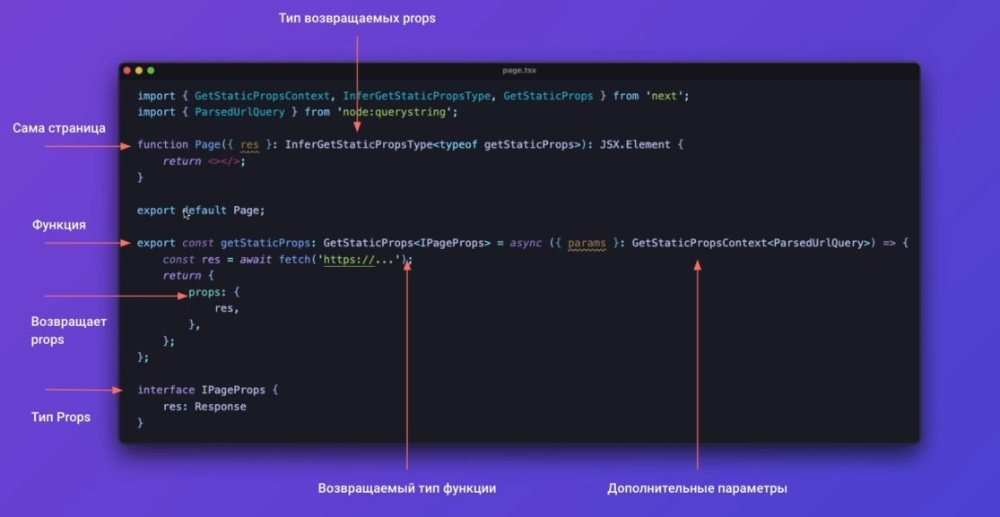
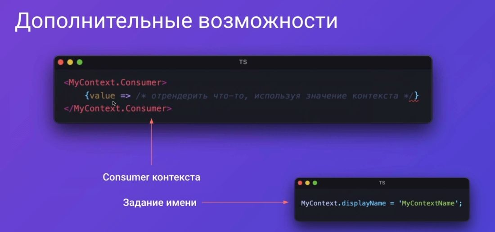
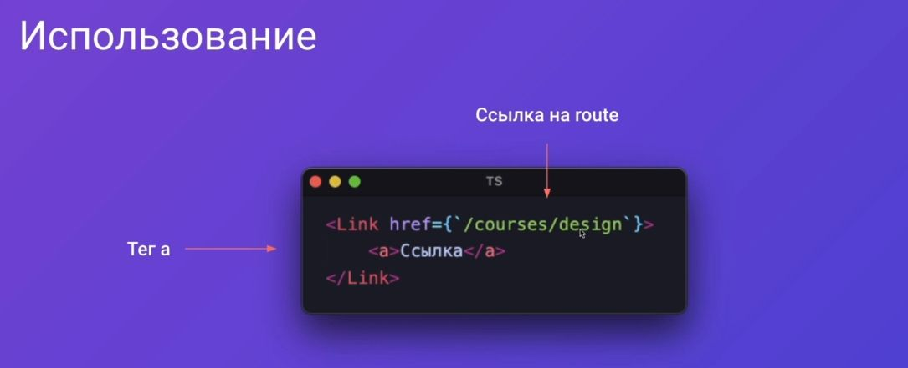
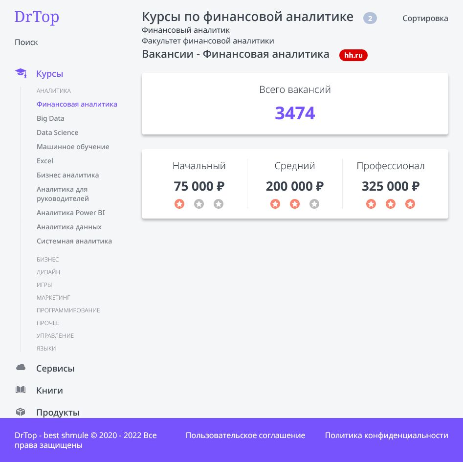

This is a [Next.js](https://nextjs.org/) project bootstrapped with [`create-next-app`](https://github.com/vercel/next.js/tree/canary/packages/create-next-app).

## Getting Started

First, run the development server:

```bash
npm run dev
# or
yarn dev
```

Open [http://localhost:3000](http://localhost:3000) with your browser to see the result.

You can start editing the page by modifying `pages/index.js`. The page auto-updates as you edit the file.

[API routes](https://nextjs.org/docs/api-routes/introduction) can be accessed on [http://localhost:3000/api/hello](http://localhost:3000/api/hello). This endpoint can be edited in `pages/api/hello.js`.

The `pages/api` directory is mapped to `/api/*`. Files in this directory are treated as [API routes](https://nextjs.org/docs/api-routes/introduction) instead of React pages.

## Learn More

To learn more about Next.js, take a look at the following resources:

- [Next.js Documentation](https://nextjs.org/docs) - learn about Next.js features and API.
- [Learn Next.js](https://nextjs.org/learn) - an interactive Next.js tutorial.

You can check out [the Next.js GitHub repository](https://github.com/vercel/next.js/) - your feedback and contributions are welcome!

## Deploy on Vercel

The easiest way to deploy your Next.js app is to use the [Vercel Platform](https://vercel.com/new?utm_medium=default-template&filter=next.js&utm_source=create-next-app&utm_campaign=create-next-app-readme) from the creators of Next.js.

Check out our [Next.js deployment documentation](https://nextjs.org/docs/deployment) for more details.

# big pets project

start project

```javascript
npx create-next-app renext-app --use-npm
cd renext-app
code .
wsl touch tsconfig.json
npm i -D typescript @types/react @types/node
```

run dev mode

```javascript
npm run dev
```


<details>
<summary>
add eslint
</summary>

add?

```javascript
npm i -D @typescript-eslint/parser @typescript-eslint/eslint-plugin
```

.eslintrs?

```javascript
{
  "root": true,
  "parser": "@typescript-eslint/parser",
  "plugins": [
    "@typescript-eslint"
  ],
  "rules": {
    "semi": "off",
    "@typescript-eslint/semi": [
      "warn"
    ],
    "@typescript-eslint/no-empty-interface": [
      "error",
      {
        "allowSingleExtends": true
      }
    ]
  },
  "extends": [
    "eslint:recommended",
    "plugin:@typescript-eslint/eslint-recommended",
    "plugin:@typescript-eslint/recommended",
    "plugin:react-hooks/recommended"
  ]
}

```

</details>

<details>
<summary>
add stylelint
</summary>

```javascript
npm i -D stylelint stylelint-config-standard stylelint-order stylelint-config-rational-order-fix
```

.stylelint.json

```javascript
{
  "extends": [
	  "stylelint-config-standard",
	  "stylelint-config-rational-order-fix"
	],
  "plugins": ["stylelint-order"],
  "rules": {
    "indentation": [2],
    "color-hex-case": "upper",
    "selector-class-pattern": "^.*$",
    "declaration-block-no-redundant-longhand-properties": [
      true,
      {
        "ignoreShorthands": ["/grid/"]
      }
    ]
  }
}

```

</details>

<details>
<summary>
debug
</summary>

```javascript
npm i -D cross-env
```

.vscode/launch.json

```javascript
{
  // Use IntelliSense to learn about possible attributes.
  // Hover to view descriptions of existing attributes.
  // For more information, visit: https://go.microsoft.com/fwlink/?linkid=830387
  "version": "0.2.0",
  "configurations": [
    {
      "type": "node",
      "request": "attach",
      "name": "Launch Program",
      "skipFiles": ["<node_internals>/**"],
      "port": 9229
    }
  ]
}
```

`F5` button


</details>

<details>
<summary>
react base
</summary>


</details>

- [add language →](./pages/_document.tsx)

- [add first component →](./components/Htag/)

<details>
<summary>
add classnanes @types
</summary>

```javascript
npm i -D @types/classnames // cn()
```

</details>

<details>
<summary>
add button ts HTML property types 
</summary>

```javascript
import { ButtonHTMLAttributes, DetailedHTMLProps, ReactNode } from "react";

export interface ButtonProps
  extends DetailedHTMLProps<
    ButtonHTMLAttributes<HTMLButtonElement>,
    HTMLButtonElement
  > {
  children: ReactNode;
  appearance: "primary" | "ghost";
  // with optional parametr ? arrow
  arrow?: "right" | "down" | "none";
}
```

look at this beauty (╯°□°）╯︵ ┻━┻


</details>

<details>
<summary>
add svg module
</summary>

```javascript
npm i -D @svgr/webpack
```

`Parsing error : Cannot find module 'next/babel'`

to fix this issue: modify eslint.config.json

```javascript
{
	"extends": [
		"next/babel", // add this ext
		"next/core-web-vitals"
	]
}
```

</details>

- [add tag component →](./components/Tag/)

<details>
<summary>
react hooks
</summary>

# react hooks


# useState hook

```javascript
import { useState } from "react";
import { Button, Htag, P, Tag } from "../components";

export default function Home(): JSX.Element {
  const [counter, setCounter] = useState(0);
  return (
    <>
      <Htag tag="h1">{counter}</Htag>
      <Button
        onClick={() => {
          setCounter((x) => x + 1);
        }}
        appearance="primary"
        arrow="right"
      >
        Button
      </Button>
    </>
  );
}
```


# useEffect hook

```javascript
import { useEffect, useState } from "react";
import { Button, Htag, P, Tag } from "../components";

export default function Home(): JSX.Element {
  const [counter, setCounter] = useState(0);

  /**
   * Хуки должны вызываться на
   * верхнем уровне, это может
   * проверить специальный плагин:
   */

  /**
   * npm i -D eslint-plugin-react-hooks
   * ДОБАВИЛ ЭТО РАСШИРЕНИЕ НО ОНО НЕХУА
   * НЕ РАБОТАЕТ
   * 
   *   if (counter > 0) {
   *   useEffect(() => {
   *   console.log("yepp");
   *   console.log("Counter " + counter);
   *   });
  }
   * 
   */

  /**
   *
   * 	 useEffect(() => {
   *		console.log("Counter " + counter);
   *		return function cleanup() {
   *		console.log("Unmount");
   *		};
   *	});
   *
   * ---res---
   *
   *  Unmount
   *  Counter 1
   *
   */

  /**
   *
   * 	 useEffect(() => {
   *		console.log("Counter " + counter);
   *		return function cleanup() {
   *		console.log("Unmount");
   *		};
   *	}, []);
   *
   * ---res---
   *
   *  Counter 0
   *
   */

  return (
    <>
      <Htag tag="h1">{counter}</Htag>
      <Button
        onClick={() => {
          setCounter((x) => x + 1);
        }}
        appearance="primary"
        arrow="right"
      >
        Button
      </Button>
    </>
  );
}
```


</details>

---

[unworking images.d.ts module →](./images.d.ts) `//no type hints`

---

<details>
<summary>
rating componenet
</summary>

[more info →](./components/Rating/)

```javascript
import { useState } from "react";
import { Rating } from "../components";

export default function Home(): JSX.Element {
  const [rating, setRating] = useState(4);

  return (
    <>
      <Rating rating={rating} isEditable setRating={setRating} />
    </>
  );
}
```

</details>

<details>
<summary>
HOC
</summary>


[look at that HOC →](./layout/Layout.tsx)
[and this, how it's work →](./pages/index.tsx)

</details>

<details>
<summary>
grid with e.g.

</summary>


[template und gap 0 →](../grid-eg/main0.css)

[align und justify 1 →](../grid-eg/main1.css)

[cell distribution 2 →](../grid-eg/main2.css)

[grid playground →](https://www.cssgridplayground.com/)

[grid template | areas 3 →](../grid-eg/main3.css)

---

## best practice??


</details>

<details>
<summary>
add basic layout
</summary>


</details>

<details>
<summary>
main layout
</summary>

## add time lib

```javascript

npm i date-fns
```


</details>

<details>
<summary>
ssr
</summary>

## env var


## browser rendering


</details>

<details>
<summary>
nextjs ssr
</summary>

## prerender





[getStaticProps e.g. →](./pages/index.tsx)


[getStaticPaths e.g. →](./pages/courses/%5Balias%5D.tsx)


</details>

<details>
<summary>
useContext
</summary>




[useContext with e.g. →](./context/app.context.tsx)

</details>

<details>
<summary>
basic menu
</summary>


</details>

<details>
<summary>
link component useRouter hook
</summary>





---

## useRouter hook


</details>

<details>
<summary>
sidebar layout
</summary>


</details>

<details>
<summary>
page component
</summary>

[page component →](./page-components/TopPageComponent/)



[page layout →](./components/HhData/)


</details>

<details>
<summary>
useReducer description
</summary>


[useReducer →](./page-components/TopPageComponent/TopPageComponent.tsx)[component →](./components/Sort/)[logic →](./page-components/TopPageComponent/sort.reducer.ts)


</details>

<details>
<summary>
searchbar
</summary>

[search bar →](./components/Search/)


</details>

<details>
<summary>
product component grid
</summary>

[product grid →](./components/Product/)


---

### [add component style](./components/Product/)


### [add more](./components/Product/)


</details>

<details>
<summary>
image component
</summary>


---

### does not work ... (╯°□°）╯︵ ┻━┻

[next.config.js](./next.config.js)

```javascript
module.exports = {
  images: {
    domains: ["courses-top.ru"],
  },
  webpack(config) {
    config.module.rules.push({
      test: /\.svg$/,
      use: ["@svgr/webpack"],
    });

    return config;
  },
};
```

Product.tsx image module

```javascript
import Image from "next/image";

<Image
  src={process.env.NEXT_PUBLIC_DOMAIN + product.image}
  alt={product.title}
  width={70}
  height={70}
/>;
```

</details>

<details>
<summary>
product layout adaptive
</summary>


</details>

<details>
<summary>
review layout adaptive
</summary>


</details>

<details>
<summary>
useForm lib concept
</summary>


---

usage

```javascript

npm i react-hook-form

```

[see detales →](./components/ReviewForm/)

</details>

<details>
<summary>
<span style='color:red'>warning : refs components</span> (проброс ref)

</summary>


</details>

<details>
<summary>
error processing
</summary>

[detales rating →](./components/Rating/)

[detales input →](./components/Input/)

[detales textarea →](./components/Textarea/)


</details>

<details>
<summary>
add common link file
</summary>

[common helpers file →](./helpers/api.ts)

</details>

<details>
<summary>
form submit logic
</summary>

[form submit logic →](./components/ReviewForm/)


</details>

<details>
<summary>
useRef hook
</summary>

[useRef hook usage →](./components/Product/Product.tsx)


</details>

---

<details>
<summary>
react animation libs
</summary>


```javascript

npm i framer-motion
```

</details>

<details>
<summary>
add custom scroll hook with animation
</summary>

for `to top` button
[useScroll custom hook →](./hooks/useScrollY.ts)


</details>

<details>
<summary>
dinamic button icon
</summary>

`to top`, `menu`, `close` buttons

[how it's work →](./components/ButtonIcon//ButtonIcon.tsx)

### типизируем по ключам

```javascript

import { ButtonHTMLAttributes, DetailedHTMLProps, ReactNode } from 'react';
import up from './up.svg'
import close from './close.svg'
import menu from './menu.svg'

export const icons = {
	up,
	close,
	menu
}

export type IconName = keyof typeof icons;

export interface ButtonIconProps extends DetailedHTMLProps<ButtonHTMLAttributes<HTMLButtonElement>,HTMLButtonElement> {
	appearance: 'primary'| 'white',
	icon: IconName // type IconName = "menu" | "up" | "close"
}

```

</details>

<details>
<summary>
add mobile menu
</summary>


</details>

<details>
<summary>
типизация для motion.button
</summary>

`button.tsx`

```javascript
import styles from "./Button.module.css";
import { ButtonProps } from "./Button.props";
import ArrowIcon from "./arrow.svg";
import cn from "classnames";

export const Button = ({
  appearance,
  arrow = "none",
  children,
  className,
  ...props
}: ButtonProps): JSX.Element => {
  return (
    <motion.button // ts conflict → add new type
      whileHover={{ scale: 1.05 }}
      className={cn(styles.button, className, {
        [styles.primary]: appearance === "primary",
        [styles.ghost]: appearance === "ghost",
      })}
      {...props}
    >
      {children}
      {arrow !== "none" && (
        <span
          className={cn(styles.arrow, {
            [styles.down]: arrow === "down",
          })}
        >
          <ArrowIcon />
        </span>
      )}
    </motion.button>
  );
};
```

`button.props.ts`

```javascript
import { ButtonHTMLAttributes, DetailedHTMLProps, ReactNode } from "react";

// (omit) → пропуск свойств из типизации тайпскрипта

export interface ButtonProps
  extends Omit<
    DetailedHTMLProps<
      ButtonHTMLAttributes<HTMLButtonElement>,
      HTMLButtonElement
    >,
    "onAnimationStart" | "onDragStart" | "onDragEnd" | "onDrag" | "ref"
  > {
  children: ReactNode;
  appearance: "primary" | "ghost";
  arrow?: "right" | "down" | "none";
}
```

</details>

<details>
<summary>
accessibility menu + main content
(доступность меню + переход на контент)
[spectrum](https://chrome.google.com/webstore/detail/spectrum/ofclemegkcmilinpcimpjkfhjfgmhieb?hl=en) - цветовая приблуда для хрома

</summary>


[keyboard accessibility →](./layout/Menu/Menu.tsx)

</details>

<details>
<summary>
accessibility form
(доступность форм)
</summary>


[form accessibility →](https://github.com/viktishchenko/big-pets/commit/223f65237080d088887e31691c1df6127953f5af)

</details>

<details>
<summary>
aria attributes
</summary>


---

## code example

html

```javascript
<div class="tabs">
  <div role="tablist" aria-label="Sample Tabs">
    <button
      role="tab"
      aria-selected="true"
      aria-controls="panel-1"
      id="tab-1"
      tabindex="0"
    >
      First Tab
    </button>
    <button
      role="tab"
      aria-selected="false"
      aria-controls="panel-2"
      id="tab-2"
      tabindex="-1"
    >
      Second Tab
    </button>
    <button
      role="tab"
      aria-selected="false"
      aria-controls="panel-3"
      id="tab-3"
      tabindex="-1"
    >
      Third Tab
    </button>
  </div>
  <div id="panel-1" role="tabpanel" tabindex="0" aria-labelledby="tab-1">
    <p>Content for the first panel</p>
  </div>
  <div id="panel-2" role="tabpanel" tabindex="0" aria-labelledby="tab-2" hidden>
    <p>Content for the second panel</p>
  </div>
  <div id="panel-3" role="tabpanel" tabindex="0" aria-labelledby="tab-3" hidden>
    <p>Content for the third panel</p>
  </div>
</div>
```

javascript

```javascript
window.addEventListener("DOMContentLoaded", () => {
  const tabs = document.querySelectorAll('[role="tab"]');
  const tabList = document.querySelector('[role="tablist"]');

  // Add a click event handler to each tab
  tabs.forEach((tab) => {
    tab.addEventListener("click", changeTabs);
  });

  // Enable arrow navigation between tabs in the tab list
  let tabFocus = 0;

  tabList.addEventListener("keydown", (e) => {
    // Move right
    if (e.keyCode === 39 || e.keyCode === 37) {
      tabs[tabFocus].setAttribute("tabindex", -1);
      if (e.keyCode === 39) {
        tabFocus++;
        // If we're at the end, go to the start
        if (tabFocus >= tabs.length) {
          tabFocus = 0;
        }
        // Move left
      } else if (e.keyCode === 37) {
        tabFocus--;
        // If we're at the start, move to the end
        if (tabFocus < 0) {
          tabFocus = tabs.length - 1;
        }
      }

      tabs[tabFocus].setAttribute("tabindex", 0);
      tabs[tabFocus].focus();
    }
  });
});

function changeTabs(e) {
  const target = e.target;
  const parent = target.parentNode;
  const grandparent = parent.parentNode;

  // Remove all current selected tabs
  parent
    .querySelectorAll('[aria-selected="true"]')
    .forEach((t) => t.setAttribute("aria-selected", false));

  // Set this tab as selected
  target.setAttribute("aria-selected", true);

  // Hide all tab panels
  grandparent
    .querySelectorAll('[role="tabpanel"]')
    .forEach((p) => p.setAttribute("hidden", true));

  // Show the selected panel
  grandparent.parentNode
    .querySelector(`#${target.getAttribute("aria-controls")}`)
    .removeAttribute("hidden");
}
```

it's look like this...


</details>

<details>
<summary>
screen reader & aria-label & aria-labelledby
</summary>

[Screen reader chrome extension →](https://chrome.google.com/webstore/detail/screen-reader/kgejglhpjiefppelpmljglcjbhoiplfn?hl=en)

---

aria label vs aria-labelledby


before

```javascript
export const Sort = ({
  sort,
  setSort,
  className,
  ...props
}: SortProps): JSX.Element => {
  return (
    <div className={cn(styles.sort, className)} {...props}>
      <button
        onClick={() => setSort(SortEnum.Rating)}
        className={cn({
          [styles.active]: sort === SortEnum.Rating,
        })}
      >
        <SortIcon className={styles.sortIcon} />
        По рейтингу
      </button>
      <button
        onClick={() => setSort(SortEnum.Price)}
        className={cn({
          [styles.active]: sort === SortEnum.Price,
        })}
      >
        <SortIcon className={styles.sortIcon} />
        По цене
      </button>
    </div>
  );
};
```

after

```javascript
export const Sort = ({
  sort,
  setSort,
  className,
  ...props
}: SortProps): JSX.Element => {
  return (
    <div className={cn(styles.sort, className)} {...props}>
      <div className={styles.sortName} id="sort">
        Сортировка
      </div>
      <button
        id="rating"
        onClick={() => setSort(SortEnum.Rating)}
        className={cn({
          [styles.active]: sort === SortEnum.Rating,
        })}
        aria-selected={sort === SortEnum.Rating}
        aria-labelledby="sort rating"
      >
        <SortIcon className={styles.sortIcon} />
        По рейтингу
      </button>
      <button
        id="price"
        onClick={() => setSort(SortEnum.Price)}
        className={cn({
          [styles.active]: sort === SortEnum.Price,
        })}
        aria-selected={sort === SortEnum.Price}
        aria-labelledby="sort price"
      >
        <SortIcon className={styles.sortIcon} />
        По цене
      </button>
    </div>
  );
};
```

---

[this commit →](https://github.com/viktishchenko/big-pets/commit/6f5ea2f104b81e4d1ada781ad59fcc81c89c2c0c)

</details>

<details>
<summary>
aria-hidden
</summary>


[this commit →](https://github.com/viktishchenko/big-pets/commit/5b1cf343919520e826d2aef5362cb8fdf02a0185)

</details>

<details>
<summary>
landmark roles
</summary>

[form role="search"](./components/Search/Search.tsx)

[main role="main"](./layout/Layout.tsx)

[menu role="navigation"](./layout/Menu//Menu.tsx)

[btn aria-expanded](./components/Product/Product.tsx) ( читать отзывы кнопка свёрнута/развёрнута)

[aria-invalid](./components/ReviewForm/ReviewForm.tsx) ( ридер воспроизводит ошибки ввода)

[ role="alert"](./components/ReviewForm/ReviewForm.tsx) (ридет воспроизводит текст оповещения)

[aria-expanded aria-current](./layout/Menu/Menu.tsx)

</details>
