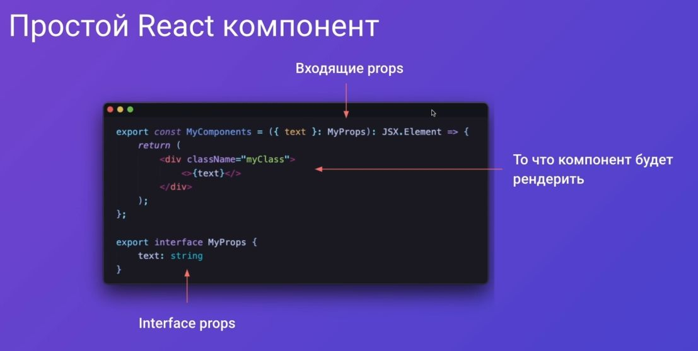
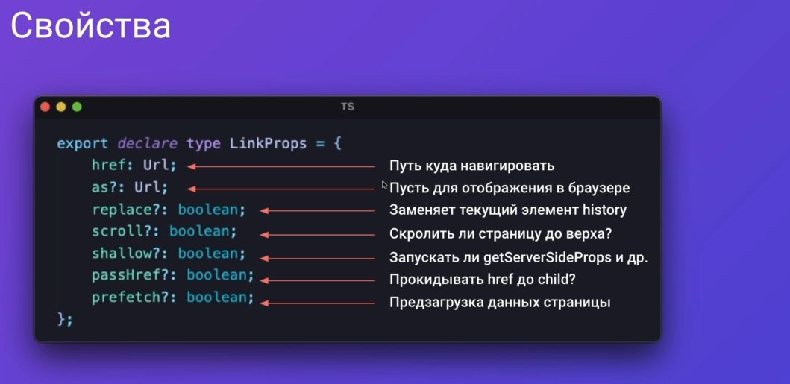
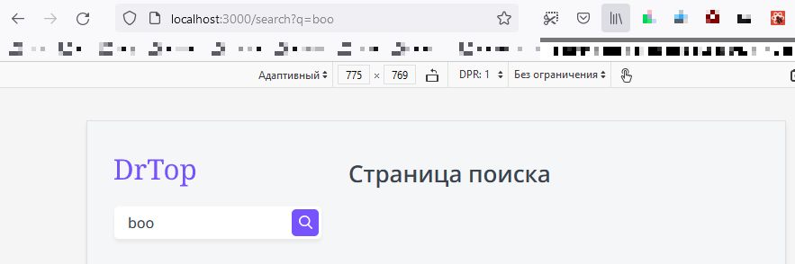

This is a [Next.js](https://nextjs.org/) project bootstrapped with [`create-next-app`](https://github.com/vercel/next.js/tree/canary/packages/create-next-app).

## Getting Started

First, run the development server:

```bash
npm run dev
# or
yarn dev
```

Open [http://localhost:3000](http://localhost:3000) with your browser to see the result.

You can start editing the page by modifying `pages/index.js`. The page auto-updates as you edit the file.

[API routes](https://nextjs.org/docs/api-routes/introduction) can be accessed on [http://localhost:3000/api/hello](http://localhost:3000/api/hello). This endpoint can be edited in `pages/api/hello.js`.

The `pages/api` directory is mapped to `/api/*`. Files in this directory are treated as [API routes](https://nextjs.org/docs/api-routes/introduction) instead of React pages.

## Learn More

To learn more about Next.js, take a look at the following resources:

- [Next.js Documentation](https://nextjs.org/docs) - learn about Next.js features and API.
- [Learn Next.js](https://nextjs.org/learn) - an interactive Next.js tutorial.

You can check out [the Next.js GitHub repository](https://github.com/vercel/next.js/) - your feedback and contributions are welcome!

## Deploy on Vercel

The easiest way to deploy your Next.js app is to use the [Vercel Platform](https://vercel.com/new?utm_medium=default-template&filter=next.js&utm_source=create-next-app&utm_campaign=create-next-app-readme) from the creators of Next.js.

Check out our [Next.js deployment documentation](https://nextjs.org/docs/deployment) for more details.

# big pets project

start project

```javascript
npx create-next-app renext-app --use-npm
cd renext-app
code .
wsl touch tsconfig.json
npm i -D typescript @types/react @types/node
```

run dev mode

```javascript
npm run dev
```


<details>
<summary>
add eslint
</summary>

add?

```javascript
npm i -D @typescript-eslint/parser @typescript-eslint/eslint-plugin
```

.eslintrs?

```javascript
{
  "root": true,
  "parser": "@typescript-eslint/parser",
  "plugins": [
    "@typescript-eslint"
  ],
  "rules": {
    "semi": "off",
    "@typescript-eslint/semi": [
      "warn"
    ],
    "@typescript-eslint/no-empty-interface": [
      "error",
      {
        "allowSingleExtends": true
      }
    ]
  },
  "extends": [
    "eslint:recommended",
    "plugin:@typescript-eslint/eslint-recommended",
    "plugin:@typescript-eslint/recommended",
    "plugin:react-hooks/recommended"
  ]
}

```

</details>

<details>
<summary>
add stylelint
</summary>

```javascript
npm i -D stylelint stylelint-config-standard stylelint-order stylelint-config-rational-order-fix
```

.stylelint.json

```javascript
{
  "extends": [
	  "stylelint-config-standard",
	  "stylelint-config-rational-order-fix"
	],
  "plugins": ["stylelint-order"],
  "rules": {
    "indentation": [2],
    "color-hex-case": "upper",
    "selector-class-pattern": "^.*$",
    "declaration-block-no-redundant-longhand-properties": [
      true,
      {
        "ignoreShorthands": ["/grid/"]
      }
    ]
  }
}

```

</details>

<details>
<summary>
debug
</summary>

```javascript
npm i -D cross-env
```

.vscode/launch.json

```javascript
{
  // Use IntelliSense to learn about possible attributes.
  // Hover to view descriptions of existing attributes.
  // For more information, visit: https://go.microsoft.com/fwlink/?linkid=830387
  "version": "0.2.0",
  "configurations": [
    {
      "type": "node",
      "request": "attach",
      "name": "Launch Program",
      "skipFiles": ["<node_internals>/**"],
      "port": 9229
    }
  ]
}
```

`F5` button


</details>

<details>
<summary>
react base
</summary>




</details>

- [add language →](./pages/_document.tsx)

- [add first component →](./components/Htag/)

<details>
<summary>
add classnanes @types
</summary>

```javascript
npm i -D @types/classnames // cn()
```

</details>

<details>
<summary>
add button ts HTML property types 
</summary>

```javascript
import { ButtonHTMLAttributes, DetailedHTMLProps, ReactNode } from "react";

export interface ButtonProps
  extends DetailedHTMLProps<
    ButtonHTMLAttributes<HTMLButtonElement>,
    HTMLButtonElement
  > {
  children: ReactNode;
  appearance: "primary" | "ghost";
  // with optional parametr ? arrow
  arrow?: "right" | "down" | "none";
}
```

look at this beauty (╯°□°）╯︵ ┻━┻


</details>

<details>
<summary>
add svg module
</summary>

```javascript
npm i -D @svgr/webpack
```

`Parsing error : Cannot find module 'next/babel'`

to fix this issue: modify eslint.config.json

```javascript
{
	"extends": [
		"next/babel", // add this ext
		"next/core-web-vitals"
	]
}
```

</details>

- [add tag component →](./components/Tag/)

<details>
<summary>
react hooks
</summary>

# react hooks


# useState hook

```javascript
import { useState } from "react";
import { Button, Htag, P, Tag } from "../components";

export default function Home(): JSX.Element {
  const [counter, setCounter] = useState(0);
  return (
    <>
      <Htag tag="h1">{counter}</Htag>
      <Button
        onClick={() => {
          setCounter((x) => x + 1);
        }}
        appearance="primary"
        arrow="right"
      >
        Button
      </Button>
    </>
  );
}
```


# useEffect hook

```javascript
import { useEffect, useState } from "react";
import { Button, Htag, P, Tag } from "../components";

export default function Home(): JSX.Element {
  const [counter, setCounter] = useState(0);

  /**
   * Хуки должны вызываться на
   * верхнем уровне, это может
   * проверить специальный плагин:
   */

  /**
   * npm i -D eslint-plugin-react-hooks
   * ДОБАВИЛ ЭТО РАСШИРЕНИЕ НО ОНО НЕХУА
   * НЕ РАБОТАЕТ
   * 
   *   if (counter > 0) {
   *   useEffect(() => {
   *   console.log("yepp");
   *   console.log("Counter " + counter);
   *   });
  }
   * 
   */

  /**
   *
   * 	 useEffect(() => {
   *		console.log("Counter " + counter);
   *		return function cleanup() {
   *		console.log("Unmount");
   *		};
   *	});
   *
   * ---res---
   *
   *  Unmount
   *  Counter 1
   *
   */

  /**
   *
   * 	 useEffect(() => {
   *		console.log("Counter " + counter);
   *		return function cleanup() {
   *		console.log("Unmount");
   *		};
   *	}, []);
   *
   * ---res---
   *
   *  Counter 0
   *
   */

  return (
    <>
      <Htag tag="h1">{counter}</Htag>
      <Button
        onClick={() => {
          setCounter((x) => x + 1);
        }}
        appearance="primary"
        arrow="right"
      >
        Button
      </Button>
    </>
  );
}
```


</details>

---

[unworking images.d.ts module →](./images.d.ts) `//no type hints`

---

<details>
<summary>
rating componenet
</summary>

[more info →](./components/Rating/)

```javascript
import { useState } from "react";
import { Rating } from "../components";

export default function Home(): JSX.Element {
  const [rating, setRating] = useState(4);

  return (
    <>
      <Rating rating={rating} isEditable setRating={setRating} />
    </>
  );
}
```

</details>

<details>
<summary>
HOC
</summary>


[look at that HOC →](./layout/Layout.tsx)
[and this, how it's work →](./pages/index.tsx)

</details>

<details>
<summary>
grid with e.g.

</summary>


[template und gap 0 →](../grid-eg/main0.css)

[align und justify 1 →](../grid-eg/main1.css)

[cell distribution 2 →](../grid-eg/main2.css)

[grid playground →](https://www.cssgridplayground.com/)

[grid template | areas 3 →](../grid-eg/main3.css)

---

## best practice??


</details>

<details>
<summary>
add basic layout
</summary>


</details>

<details>
<summary>
main layout
</summary>

## add time lib

```javascript

npm i date-fns
```


</details>

<details>
<summary>
ssr
</summary>

## env var


## browser rendering


</details>

<details>
<summary>
nextjs ssr
</summary>

## prerender


[getStaticProps e.g. →](./pages/index.tsx)


[getStaticPaths e.g. →](./pages/courses/%5Balias%5D.tsx)


</details>

<details>
<summary>
useContext
</summary>


[useContext with e.g. →](./context/app.context.tsx)

</details>

<details>
<summary>
basic menu
</summary>


</details>

<details>
<summary>
link component useRouter hook
</summary>




---

## useRouter hook


</details>

<details>
<summary>
sidebar layout
</summary>


</details>

<details>
<summary>
page component
</summary>

[page component →](./page-components/TopPageComponent/)


[page layout →](./components/HhData/)


</details>

<details>
<summary>
useReducer description
</summary>


[useReducer →](./page-components/TopPageComponent/TopPageComponent.tsx)[component →](./components/Sort/)[logic →](./page-components/TopPageComponent/sort.reducer.ts)


</details>

<details>
<summary>
searchbar
</summary>

[search bar →](./components/Search/)



</details>

<details>
<summary>
product component grid
</summary>

[product grid →](./components/Product/)


---

### [add component style](./components/Product/)


### [add more](./components/Product/)


</details>

<details>
<summary>
image component
</summary>


---

### does not work ... (╯°□°）╯︵ ┻━┻

[next.config.js](./next.config.js)

```javascript
module.exports = {
  images: {
    domains: ["courses-top.ru"],
  },
  webpack(config) {
    config.module.rules.push({
      test: /\.svg$/,
      use: ["@svgr/webpack"],
    });

    return config;
  },
};
```

Product.tsx image module

```javascript
import Image from "next/image";

<Image
  src={process.env.NEXT_PUBLIC_DOMAIN + product.image}
  alt={product.title}
  width={70}
  height={70}
/>;
```

</details>

<details>
<summary>
product layout adaptive
</summary>


</details>
